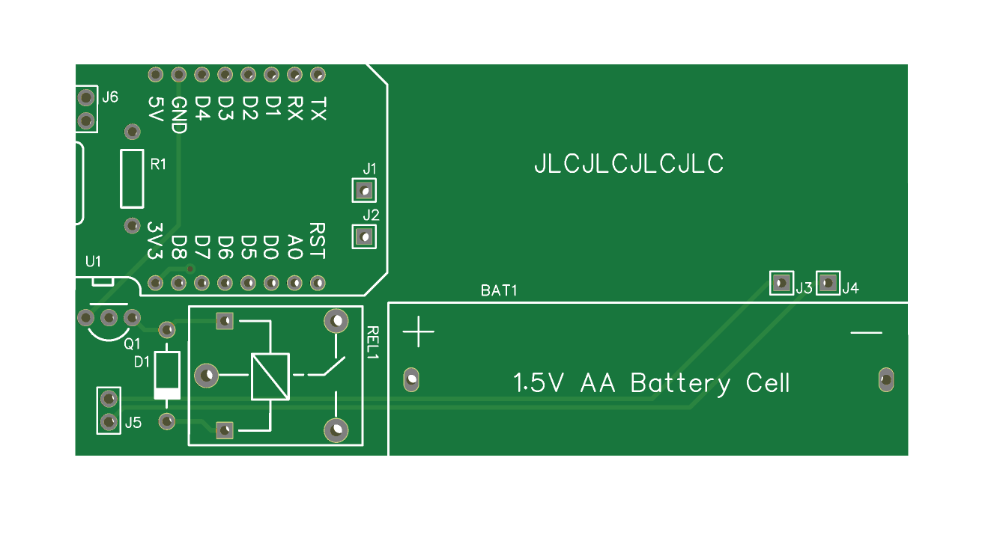
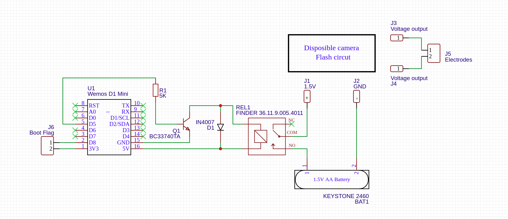

# ⚡ dispo-shocker

### Homemade electric shocker, made from a disposible camera.

⚠ *This repository is mainly concerned with hardware. For examples on writing software for this, check out taetris-stun.*

## How does work?

This whole thing is based on that **disposible camera flash circuit**. Normaly in a disposible camera there'd be a circuit that takes 1.5 V from a AAA battery and boosts it up to arround 310V for the integrated flash to use. Instead of attaching a flash, the output goes through a human body.

The microcontroller drives a transistor which drives a relay which in turn opens and closes the connection of the battery to the flash circuit.

Using a Wemos D1 mini enables me to electrecute myself (or friend who of course have given consent) over the internet. A good point to mention that this is...

## ⛔ DANGEROUS!

> **Do not use this on people with any kind of heart condition or simular things!**

> **Do not use this on old people!**

> **Only shock people that have given consent!**

> **I (tinkertoe) will not take liabillity for any inguries!**

## Parts list

| Quantity | Name                                | Exact Part Name         |
| -------- | ----------------------------------- | ----------------------- |
| 1        | Wemos D1 mini                       |                         |
| 1        | 1㏀ resistor                        |                         |
| 1        | NPN transistor                      | BC33740TA               |
| 1        | diode                               | IN4007                  |
| 1        | 5V Relay                            | FINDER 36.11.9.005.4011 |
| 1        | AA Battery holder                   | Keystone 2460           |
| 1        | **Disposible camera flash circuit** | ?                       |
| 2        | 2x1 Male pin header                 |                         |
| 1        | 2x1 Jumper bridge                   |                         |

## How to import project

Under the folder `EasyEDA` you'll be able to find a folder called `dispo-shocker`. I recommend you copy that one straight into your EasyEDA offline projects directory. If you are using the online version you'll have to open the files individually.

## Pictures

